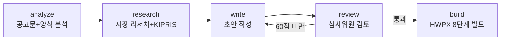
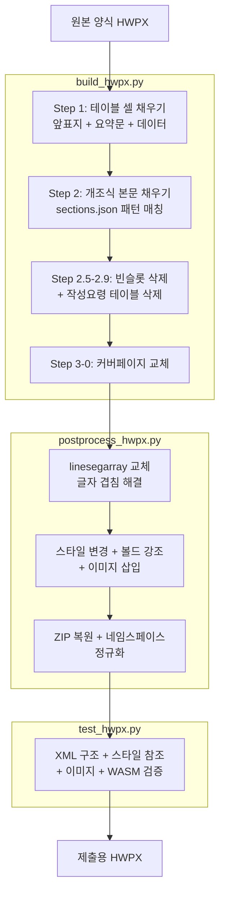

# k-proposal

**정부지원사업 사업계획서를 합격 수준으로 만들어주는 AI 에이전트**

공고문을 넣으면 평가기준을 분석하고, 양식이 요구하는 작성요령을 빠짐없이 반영한 초안을 쓰고, 심사위원 관점에서 채점하고, 한글(HWPX) 제출 파일까지 생성한다. AI가 쓴 티도 지워준다.

**5개 스킬** | **4명 에이전트 병렬** | **10개 양식 충족 게이트** | **8단계 HWPX 빌드** | **30개 광탈 패턴 차단**

---

## 왜 k-proposal인가

**양식 작성요령 자동 반영** -- 양식의 작성요령 테이블에서 "시장규모 기재", "TRL 명시" 같은 요구사항을 자동 추출하여 초안에 1:1 매핑. 심사위원이 보는 "양식 지시사항 이행 여부"를 자동으로 충족한다.

**심사위원 관점 이중 관문** -- 필수항목 10개 사전검증(양식 충족 게이트) + 평가기준별 모의 채점. 60점 미만이면 HWPX 생성을 차단하고 약점을 자동 보강한다.

**휴먼라이징** -- "본 사업은 ~을 목적으로 하며" 같은 AI 작성 흔적 30개 패턴을 탐지하고 사람 문체로 치환. 심사역은 AI 문체를 3초 만에 알아챈다.

**end-to-end HWPX 빌드** -- 앞표지, 요약문, 본문, 이미지까지 양식에 채워넣고 작성요령 삭제, 네임스페이스 정규화, 글자 겹침 수정을 거쳐 바로 제출 가능한 파일을 생성한다.

---

## 빠른 시작

### 1. 설치

```bash
git clone https://github.com/myorange-io/k-proposal.git
cd k-proposal && ./setup.sh
```

### 2. 자료 준비

프로젝트 폴더에 아래 파일을 넣는다.

**필수**: 모집공고문(HWPX/HWP/PDF) + 작성서식(HWPX) + 사업자등록증 + 재무제표

**있으면 좋은 것**: 서비스소개서, IR 자료, 특허등록증/출원서, 팀원 이력서, 수상이력, 고객사 계약서

> `.hwp` 파일은 kordoc MCP가 설치되어 있으면 자동 파싱. 없으면 한글에서 HWPX로 변환.

### 3. 실행

```
사업계획서 작성해줘
TIPS 연구개발계획서 작성해줘
```

특정 단계만 실행할 수도 있다:

```
공고문 분석해줘          → /proposal-analyze
시장 리서치 해줘         → /proposal-research
초안 작성해줘            → /proposal-write
계획서 검토해줘          → /proposal-review
HWPX 채워줘             → /proposal-build
```

### 4. 결과물

```
프로젝트폴더/
├── 제출용_사업계획서.hwpx        ← 바로 제출 가능한 HWPX
├── _시각자료/                    ← 시장규모 차트, 아키텍처 다이어그램
├── _초안_sections.json           ← 본문 서술형 구조화 데이터
├── _초안_fill.json               ← 테이블 셀 데이터 (앞표지+요약문)
├── _심사위원_검토결과.md         ← 모의 채점 + 개선 내역
└── _양식충족_검증결과.md         ← 필수항목 10개 사전검증
```

---

## 작동 원리

5개 독립 스킬이 파이프라인으로 연결된다. 각 스킬은 단독으로도 사용 가능.



| 스킬 | 핵심 동작 | 단독 트리거 |
|------|----------|-----------|
| `/proposal-analyze` | 공고문에서 평가기준, 예산규칙, 일정 추출. 양식 테이블맵 + **작성요령 텍스트 자동 추출** | "공고문 분석해줘" |
| `/proposal-research` | 시장 리서치 + KIPRIS 특허 10건 검색 + 출처 URL 검증 | "시장 리서치 해줘" |
| `/proposal-write` | `sections.json` + `fill.json` 동시 생성. **작성요령 1:1 매핑**. 휴먼라이징 + 시각자료 | "초안 작성해줘" |
| `/proposal-review` | 양식 충족 게이트(10항목) + 모의 채점 + 킬러 질문 + 약점 보강 | "계획서 검토해줘" |
| `/proposal-build` | 앞표지 → 본문 → 빈슬롯 삭제 → 작성요령 삭제 → 후처리 → WASM 검증 | "HWPX 채워줘" |

### 양식 충족 게이트 + 심사위원 검토

초안 → HWPX 빌드 사이에 수행하는 이중 관문:

**양식 충족 게이트** (1개라도 미충족 시 채점 차단):

| 검증 항목 | 내용 |
|----------|------|
| 앞표지/요약문 | 과제명, 기관명, 연구책임자, 최종목표, 핵심어 |
| KIPRIS | 문장검색 결과 10건 포함 |
| 위탁기관 | 기관명 특정 + 역할분담 근거 |
| 기술유출 방지 | 비밀유지, 접근통제, 데이터 격리 기재 |
| 고용창출 | 스톡옵션, 내일채움공제, 교육프로그램 |
| 안전/보안 | 5-1, 5-2, 5-3 각각 구분 기재 |
| 커버페이지 | 플레이스홀더 실제 값 교체 |
| 빈 슬롯 | ◦/- 단락 잔존 없음 |
| 단위 정합 | 사업화 목표 단위(백만원 vs 천원) 일치 |

**심사위원 모의 채점**: 평가기준별 100점. 60점 미만 항목이 있으면 약점 보강 후 재채점 (최대 2회).

**킬러 질문**: "사업비 규모 적정 근거?", "경쟁사 대비 차별점 한 문장?" 등 실제 평가 질문 생성. 초안만으로 답변 불가 시 내용 추가.

---

## TIPS 일반트랙

민관공동창업자발굴육성(TIPS) -- 운영사(VC)가 선투자하고 정부가 R&D 자금을 매칭하는 프로그램.
2026년 대개편: **R&D 최대 8억원**, 선정 **800개사**, 비수도권 **50% 우선 할당**.

```
TIPS 연구개발계획서 작성해줘
```

tips/ 폴더에 공고 자료를 넣으면 TIPS 전용 워크플로우가 자동 활성화된다.

### TIPS 전용 기능

| 기능 | 설명 |
|------|------|
| 서류평가 4대항목 매칭 | 문제인식 / 실현가능성 / 성장전략 / 팀구성에 1:1 대응 |
| 심사위원 3인 시뮬레이션 | 기술전문가 + 사업화전문가 + 투자자 채점 + 킬러 질문 10개 |
| 성능지표 역설계 | 선정 + 최종평가 동시 달성 목표 수준 자동 판정 (세계최고 대비 60-80%) |
| 후속 투자 시나리오 | TIPS R&D → Post-TIPS → 시리즈A 성장 사다리 |
| 예산 자동 검증 | 2026년 인건비 단가, 비목별 한도, "1식" 금지 |
| 가점 자동 스캔 | 비수도권(3점), ESG(2점), 벤처인증(1점), 퇴직연금(1점) |
| 분량 비율 검증 | 기술 40% / 사업화 30% / 팀 30% 밸런스 |
| 핵심 3문 | Why Now / Why Us / Why 정부 R&D |

### 2026년 주요 변경사항

| 항목 | 변경 전 | 변경 후 |
|------|--------|--------|
| R&D 지원금 | 5억원 | **최대 8억원** |
| 선정 규모 | 700개사 | **800개사** |
| 접수 방식 | 수시 | **분기별** (1, 2, 3분기) |
| 선투자(수도권) | 1-2억 | **2억 이상** |
| 가점 최대 | 3점 | **5점** |
| 비수도권 | - | **선정 50% 우선 할당** |

---

## HWPX 빌드 파이프라인

양식 HWPX에 초안 데이터를 채워넣어 제출 파일을 생성하는 8단계:



### 빌드 완료 조건

| 조건 | 검증 |
|------|------|
| 앞표지/요약문 필수 셀 기입 | test_hwpx.py |
| 본문 빈 ◦/- 단락 0개 | Step 2.7 자동 삭제 |
| 작성요령 테이블 0개 | Step 2.9 자동 삭제 |
| 커버 플레이스홀더 0개 | Step 3-0 자동 교체 |
| test_hwpx.py 전 항목 PASS | 자동 실행 |
| @rhwp/core WASM 파싱 성공 | `--rhwp` 플래그 |

---

## 최근 업데이트

### 2026-04-16: rhwp 참고 반영 + 작성요령 자동 추출

- **@rhwp/core WASM 검증** -- 빌드 결과물을 Rust/WASM 파서로 실제 파싱+렌더링 테스트. `test_hwpx.py --rhwp`로 활성화
- **누름틀(ClickHere) 필드 API** -- HWPX 양식의 누름틀 필드 자동 감지(`detect-fields`) 및 값 설정(`fill-field`)
- **작성요령 자동 추출** -- 양식의 작성요령 테이블 전체 텍스트를 `guide_table_contents`로 추출. `writing_guide_full` 필드를 통해 writer가 양식 요구사항을 빠짐없이 반영
- **xml-internals 보강** -- 폰트 폴백 매핑, Field API 참조, HWP vs HWPX 비교, LINE_SEG 재계산 로드맵

### 2026-04-10: 아키텍처 대개편

- **독립 스킬 분리** -- 모놀리식 1,768줄을 analyze/research/write/review/build 5개 스킬로 분리
- **유형별 템플릿 분리** -- tips/, startup/, scaleup/, regional/ 디렉토리별 독립 템플릿. `template_dir` 자동 로딩
- **양식 충족 게이트** -- HWPX 생성 전 10개 필수항목 사전검증 + 심사위원 모의 채점 이중 관문
- **KIPRIS 특허 검색** -- 핵심 기술 기반 유사 등록특허 10건 자동 검색

---

## 프로젝트 구조

```
k-proposal/
├── setup.sh                  # 원스텝 설치 (Python + npm + MCP)
├── package.json              # @rhwp/core WASM 검증 의존성
├── CLAUDE.md                 # 스킬 라우팅 + MCP 설정
├── .claude/
│   ├── agents/               # 4명 Agent Teams (researcher/writer/reviewer/visualizer)
│   └── skills/               # 6개 스킬 (orchestrator + 5개 파이프라인)
├── skill/                    # 핵심 도구
│   ├── hwpx_handler.py       #   HWPX 분석/채우기/이미지삽입/누름틀 필드
│   ├── visual_gen.py         #   시각자료 (matplotlib + Gemini)
│   └── kordoc_bridge.py      #   kordoc CLI 브릿지
├── scripts/                  # 빌드 파이프라인
│   ├── build_hwpx.py         #   8단계 HWPX 빌드
│   ├── postprocess_hwpx.py   #   후처리 (겹침해결/볼드/이미지/NS)
│   ├── auto_template_map.py  #   양식 자동 인식 + 작성요령 추출
│   ├── validate_rhwp.mjs     #   @rhwp/core WASM 검증
│   └── test_hwpx.py          #   HWPX 파일 자동 검증
├── templates/                # 유형별 JSON 템플릿
│   ├── tips/                 #   TIPS R&D (완성)
│   ├── startup/              #   예비창업/초기창업패키지
│   ├── scaleup/              #   창업도약패키지
│   └── regional/             #   지역 R&D/사업화
├── references/               # HWPX XML 내부 구조 레퍼런스
└── tips/                     # TIPS 공고 자료 + template_map
```

---

<details>
<summary><strong>명령어 참고</strong></summary>

### HWPX 양식 조작

```bash
HANDLER="python skill/hwpx_handler.py"

$HANDLER analyze "양식.hwpx"                                        # 전체 구조 + 누름틀 필드
$HANDLER read-table "양식.hwpx" -t 3 --json                         # JSON 형식 읽기
$HANDLER fill "양식.hwpx" "출력.hwpx" --data data.json               # 채우기
$HANDLER fill "양식.hwpx" "출력.hwpx" --data data.json --validate    # 사전 검증만
$HANDLER detect-fields "양식.hwpx" --json                            # 누름틀 필드 감지
$HANDLER fill-field "양식.hwpx" "출력.hwpx" -n "회사명" -v "마이오렌지"  # 누름틀 값 설정
$HANDLER insert-text "양식.hwpx" "출력.hwpx" --after-table 5 --text "본문"
$HANDLER insert-image "양식.hwpx" "출력.hwpx" --after-table 5 -i chart.png
```

### 양식 분석 + 작성요령 추출

```bash
python scripts/auto_template_map.py "양식.hwpx" -o template_map.json
python scripts/auto_template_map.py "양식.hwpx" -o template_map.json \
  --enrich-sections templates/tips/sections_template.json             # writing_guide_full 자동 추가
```

### 검증

```bash
python scripts/test_hwpx.py "제출용.hwpx" --orig "원본양식.hwpx"       # 정적 검증
python scripts/test_hwpx.py "제출용.hwpx" --rhwp                      # + WASM 파싱 검증
```

### 시각자료

```bash
python skill/visual_gen.py chart config.json -o chart.png
python skill/visual_gen.py gemini "System architecture diagram" -o arch.png
```

</details>

---

## 의존성

```bash
./setup.sh  # 아래를 한 번에 처리
```

| 구분 | 패키지 | 용도 |
|------|--------|------|
| Python | `lxml`, `python-docx`, `matplotlib`, `Pillow` | HWPX 조작, 시각자료 (필수) |
| Python | `google-genai` | Gemini 이미지 생성 (선택) |
| npm | `kordoc-mcp` | HWP/PDF 파싱 MCP 서버 (권장) |
| npm | `@rhwp/core` | HWPX/HWP WASM 파싱 검증 (선택) |

### kordoc MCP 설정

`.cursor/mcp.json`:
```json
{
  "mcpServers": {
    "kordoc": {
      "command": "kordoc-mcp",
      "args": []
    }
  }
}
```

---

## 참고한 저장소

| 저장소 | 참고 내용 |
|--------|----------|
| [chrisryugj/kordoc](https://github.com/chrisryugj/kordoc) | HWP/HWPX/PDF 통합 파싱, 양식 필드 인식, MCP 서버 |
| [edwardkim/rhwp](https://github.com/edwardkim/rhwp) | Rust+WASM HWP/HWPX 파서, Field API, LINE_SEG 재계산 |
| [merryAI/hwpx-report-automation](https://github.com/merryAI-dev/hwpx-report-automation) | HWPX 이미지 삽입 3단계 방식 |
| [203050company/kstartup-business-plan-reviewer](https://github.com/203050company/kstartup-business-plan-reviewer) | 광탈 패턴 감지, 휴먼라이징 |
| [Canine89/gonggong_hwpxskills](https://github.com/Canine89/gonggong_hwpxskills) | 네임스페이스 정규화, XML 레퍼런스 |
| [merryAI-dev/hwpx-filler](https://github.com/merryAI-dev/hwpx-filler) | Rust+WASM HWPX 셀 채우기 |

## 라이선스

[MIT License](LICENSE) &copy; 2026 MyOrange
